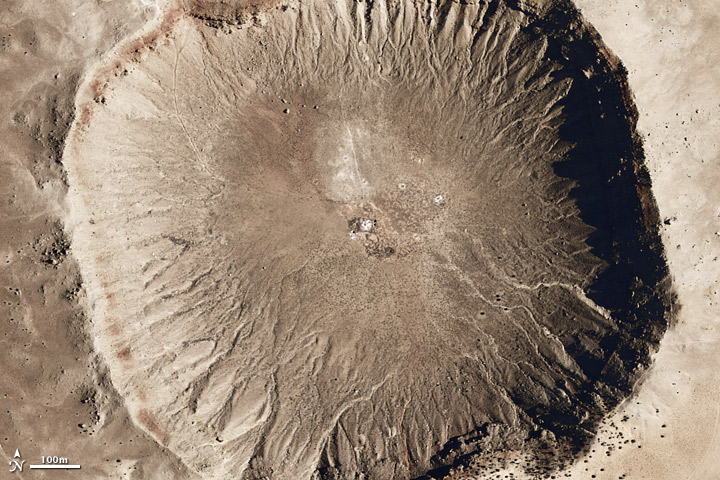
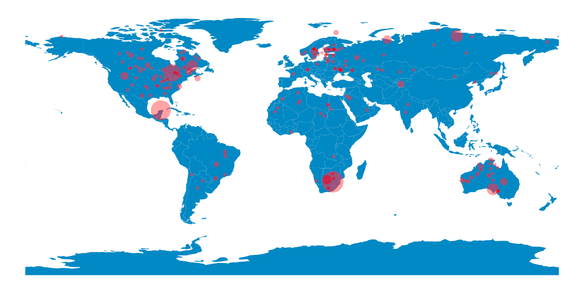

# impact-craters
A visualization and analysis of impact craters on Earth

A NASA image of Meteor Crater (Barringer Crater) in Arizona, USA

This Jupyter Notebook accesses data from the [Earth Impact Database](http://www.passc.net/EarthImpactDatabase/New%20website_05-2018/Index.html) to analyse the known Earth impact craters and to produce a map of their locations:

